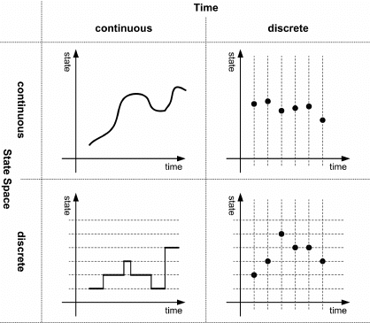

# Introduction

This R document will illustrate, step by step, how to simulate the fluctuation (Luria-Delbrück) experiment. The experimental design of the Luria Delbrück experiment is elegant and simple, which we can simply simulate in R. For increasingly complex simulations, I generally do not recommend using R. However, as R is a language many people are familiar with, we can instead skip all the technical stuff and dive right in.

## Why simulate? 

You may wonder what the point is of simulating an experiment, especially *after* an experiment that has already been performed *in vitro* or *in vivo*. There are however various benefits of replicating your experiments *in silico*, for example: 

1. You have multiple hypotheses/mechanisms in your mind that may explain your data
   * Test which hypotheses CAN explain your data, and which CAN not explain your data
   * If multiple hypotheses work, are there combination effects? (e.g. mutual exclusivity)
2. You understand the basic principles in your system, but you do not have a hypothesis
   * Building your system from the bottom up requires no prior hypothesis
   * Investigate emergent properties (what complex behaviour emerges from the bottom-up rules)
   * May generate novel hypotheses that can be experimentally verified
3. You want to investigate further, but it's expensive and/or experimentally unfeasible
   * Track slightly beneficial fitness effects
   * Redistributing DNA barcodes after coalescence
   * Repeat 1 million experiments
   * Investigate long-term evolution

The Luria-Delbrück experiment has a clear hypothesis: repeatedly growing populations in non-selective media will generate a highly variable number of mutants. The reason for this is that mutations that occur early in the growth phase will become much more prevalant than mutations that occur later (IMAGE FOR THIS!??). From this experiment, we can infer that mutations are random (if they weren't, it makes no sense to discuss mutants that arose early or late!). Thus, we will use a simulation to confirm that repeated growth-cycles will yield a highly variable number of mutant colonies **only if mutations are random**. 

<center></center>

## Making our assumptions explicit

<center>{width=70%}</center>

In modelling, there are two types of assumptions. First, there are the assumptions that we make about the biology (well-mixed environment, random mutations, *etc.*). There are however also assumptions that are not about biology, but about more fundamental things. For example, is "time" discrete or continuous? Are we considering a finite population or an infinite population? While a very popular modelling strategy in biology is to use ordinary differential equations (ODEs, which assume continuous time with continuous population sizes), writing a simple simulation loop like we will do below, implies that we take *discrete time steps*. Although we won't focus on this today, please note that these differences may matter! In any case, let's make our assumptions explicit:

* The population grows in a well-mixed environment
* All cells (including mutants) grow at the same rate 
* Mutations occur randomly
* Time occurs in discrete time steps
* The population is finite (*i.e.* there's no such thing as "half a cell")


Besides these explicit assumptions about the biology, there are also assumptions that come along with ou

* Time can be continuous or discrete
* The population size can be continuous or discrete
* 

.   --> mutationsare random /density dependence  is implicit ex
explicit, such as "a well-mixed culture" or "
As models are simplification of reality, we have to consider exactly how to simplify. In making simpli
Assumptions are the bread and butter of modeling, 

assume about are system. When studying ecology or evolution, we are interesting in **change** over **time**. So the first questions we need to ask ourselves are: what is actually changing (*i.e.* what is the variable), and how do we assume "time" works? One of the most popular modeling techniques is that of ordinary differential equations (ODEs), where both time and the variables are continuous. Many of you may be familiar with the famous Lotka-Volterra equations, which can for example describe the oscillations seen in predator-prey systems. A potential problem that may arrise here, is that "predators" and "prey" are of course not continuous variable in reality. It is important to keep such assumptions in mind, lest you draw to conclusions about 0.001% of a fox establishing a new colony in England (this is not even made up). Similarly, we wouldn't want to see 0.01% of a mutant be able to grow on our plates! So perhaps it is better to have discrete numbers of cells in our model. For this, we could go for a discrete variable in continuous time, such as shown on the bottom right. However, the algorithms required to do that (Gillespie algorithms) are not very intuitive, so lets start some place simpler. Lets start discrete units, and discrete time. This is easy, because this means we can simply write a simple for or while loop in our code, where each step represents a "time step".


```{r setup, include=FALSE}
knitr::opts_chunk$set(echo = TRUE)

# Setup chunk always runs when opening your RMD project. Instead of just blindly
# trying to install the packages, I first test if they are already installed by
# using `require`. 

if(!require(dqrng)) install.packages("dqrng", repos = "http://cran.us.r-project.org") # Random number generator
if(!require(tidyr)) install.packages("tidyr", repos = "http://cran.us.r-project.org") # R Data manipulation tricks 
if(!require(ggplot2)) install.packages("ggplot2", repos = "http://cran.us.r-project.org") # Plotting
if(!require(patchwork)) install.packages("patchwork", repos = "http://cran.us.r-project.org") # Putting plots next to eachother

library(dqrng)
library(dplyr)
library(ggplot2)
library(patchwork)

theme_set(theme_bw())
set.seed(5)

```


# more tips
In this course, we will simulate a biological system which evolves through natural selection. This requires: 

1. Reproduction (e.g. a population of dividing cells)

2. Mutations (that are inherited from parent to offspring)

3. Selection (certain traits are more likely to survive)

We're going to try and make a model of these processes without using any existing modeling packages. Of course, such
packages are useful, but it is very important for you to learn how to build something from the ground up. R packages I 
recommend are "branching" for modelling branching processes and GrindR for modelling populations through differential equations
(yes, it is actually called that). For more complex models (e.g. individual-based models with spatial structure),
I would not recommend R. You can give Cacatoo a try (https://github.com/bramvandijk88/cacatoo), which is coded in Javascript.

## 1) Modeling growth


```{r exponential growth}


# Below is a simple function to model exponential growth. The speed of exponential
# growth is given by 'r', where r > 1 gives exponential growth, and r < 1 gives
# expontential decay. 

exponentialGrowth=function(maxTime, r){
  N <- 1e6 # Initial population size. In modelling, usually denoted with 'N'
  t <- 1
  output <- data.frame(Time=t,Cellcount=N)
  while(t<maxTime){
      
     #every generation the population size doubles
     N <- r*N
     t <- t+1
     output <- rbind(output,data.frame(Time=t,Cellcount=N))
  }
  #return the size of the population at the end of the function
  return(output)
}

exp_growth=exponentialGrowth(24,2) # With r=2, the population simply doubles every time step
 
## If you want to plot with base R, see:
# plot(x=exp_growth$time,y=exp_growth$cellcount,type="l")

## But I like ggplot:
exp_growth %>% 
  ggplot(aes(x=Time,y=Cellcount)) +
  geom_line(col="navy",size=1.5) +
  ggtitle("Exponential growth")

```

## Questions about the figure above:

* How is the figure different from how you expect bacteria to grow in a culture medium? 
* Discuss situations where the differences may be important.


```{r logistic growth}

# Logistic growth is a way to model a population growing to a certain carrying 
# capacity 'K' with growth rate 'r'. In this equation, all r>0 gives growth (so please note: it's different from the r above!)

logisticGrowth=function(maxTime, K, r){
  N <- 1e6 # Initial population size
  t <- 1
  output <- data.frame(Time=t,Cellcount=N)
  while(t<maxTime){
      
     #every generation the population size doubles
     N <- N + N * r * (1 - (N/K))
     t <- t+1
     output <- rbind(output,data.frame(Time=t,Cellcount=N))
  }
  #return the size of the population at the end of the function
  return(output)
}

log_growth=logisticGrowth(24, 2*10e8, 1.0)

p1 <- log_growth %>% 
  ggplot(aes(x=Time,y=Cellcount)) +
  geom_line(col="navy",size=1.5) +
  ggtitle("Logistic growth") 


p2 <- p1 + scale_y_log10() + ggtitle("Logistic_growth (log y)")

p1 + p2
```

## Questions about the figure above:

* Is the growth now identical to growth in a culture medium? Why/why not?
* How many cell divisions were there with simple exponential growth? How many were there with logistic growth? Could it matter which we pick for modelling the emergence of resistant mutants?

## 1) Modeling mutations

Next, it is up to you to continue our model. Let us include mutations. Extend the above logistic growth model by assuming two types of cells: wildtype cells, and mutant cells. For simplicity, start with the following assumptions:

* Only 1 type of mutants exists 
* Mutations occur when the wildtype reproduces
* Mutations do not occur when mutants reproduce (i.e. no back-mutations or second-order mutants)
* Note: mutations occur with a certain probability, not a rate!


** LATER DUS MIJN VERSIE WEGHALEN ** For simplicity, we will simply assume there are two types: the wildtype and their mutants. Starting from a population of 1 million wildtype cells, we will 

```{r logistic growth + deterministic mutations}

genomeLength=4629812 #Escherichia coli B REL606
mutationRate=2.2* 10^(-10) #Lee et al. 2012 PNAS
maxPopSize=2*10^8 #max population size in the simulation

MutationAccumulation=function(maxTime, K, r){
  N <- 1e6 # Initial population size
  t <- 1
  M <- 0 # No. mutants
  output <- data.frame(Time=t,Cellcount=N,Mutants=M)
  while(t<maxTime){
     
     N_births <- floor(N * r * (1 - (N+M)/K))
     #num_of_new_mutants <- N_births*mutationRate*genomeLength
     
     num_of_new_mutants <- rbinom(1, N_births, mutationRate*13) # Mutation rate is per basepair, and there are 13 mutations known 
     #num_of_new_mutants <- floor(N_births * mutationRate*13)   # If mutations weren't random
     N <- floor(N + N * r * (1 - (N+M)/K) - num_of_new_mutants)
     M <- floor(M + M * r * (1 - (N+M)/K) + num_of_new_mutants)
   
     t <- t+1
     output <- rbind(output,data.frame(Time=t,Cellcount=N,Mutants=M))
  }
  #return the size of the population at the end of the function
  return(output)
}

experiment <- MutationAccumulation(50,2e9,1.0)

p1 <- experiment %>% 
  ggplot(aes(x=Time,y=Cellcount)) +
  geom_line(col="navy",size=1.5) +
  geom_line(aes(y=Mutants),col="red",size=1.5) +
  ggtitle("Mutation accumulation") 


p2 <- p1 + scale_y_log10() + ggtitle("Mutation accumulation (log y)")

p1 + p2

```

## Mutations

* What is the difference between a rate and a probability?


```{r repeat}

MutationAccumulation=function(maxTime, K, r){
  N <- 1e6 # Initial population size
  t <- 1
  M <- 0 # No. mutants
  while(t<maxTime){
     
     #every generation the population size doubles
     N_births <- floor(N * r * (1 - (N+M)/K))
     #num_of_new_mutants <- N_births*mutationRate*genomeLength
     
     num_of_new_mutants <- rbinom(1, N_births, mutationRate*13) # Mutation rate is per basepair, and there are 13 mutations known 
     #num_of_new_mutants <- floor(N_births * mutationRate*13)   # If mutations weren't random
     N <- floor(N + N * r * (1 - (N+M)/K) - num_of_new_mutants)
     M <- floor(M + M * r * (1 - (N+M)/K) + num_of_new_mutants)
   
     t <- t+1
  }
  #return the size of the population at the end of the function
  return(data.frame(Time=t,Cellcount=N,Mutants=M))
}

N<- 100 

all_experiments = data.frame()

for(i in 1:N)
{
  experiment <- MutationAccumulation(50,2e9,1.0)
  experiment$replicate <- i-1
  all_experiments <- rbind(all_experiments, experiment)
}

p1 <- all_experiments %>% filter(Time==max(Time)) %>%
  ggplot(aes(x=Mutants)) +
  geom_histogram(bins=100,fill="gold3") +
  #xlim(-2,100)+
  ggtitle("Mutation accumulation") 

p1

# Or if you want to get fancy and make it look like plates
# (note, only works when the square root of N is a whole number)

plates <- all_experiments %>%
  mutate(row=replicate%%sqrt(N)) %>%
  mutate(col=floor(replicate/sqrt(N))) %>%
  select(col,row,Mutants) %>%
  complete(row,col) 

plates <- as.data.frame(lapply(plates,rep,as.numeric(plates$Mutants)))

plates %>%
  ggplot(aes(x=col,y=row)) +
  geom_point(data=data.frame(row=floor((0:(N-1)/sqrt(N))),col=rep(1:sqrt(N),N)-1),pch=21,col="black",fill="white",stroke=1,size=12) +
  geom_jitter(data=plates,width=0.27,height=0.27,pch=20,col="gold3",size=1) +
  coord_fixed() +
  theme_void() +
  theme(plot.title=element_text(hjust=0.5)) +
  ggtitle("Fluctuation test plates",)


```

## Simulating evolution

## Using random numbers for stochastic events 

To simulate mutations, we need a way to implement stochastic events. In 
computer programs, this is usually done by means of a *random number 
generator* (RNG). For example, R has a build-in RNG: `runif(1)`. This generates
a number between 0 and 1. So if you want to for example build in a 1% chance 
of something happening, you can generate a random number and test if it is smaller
than 0.01: `if(runif(1) < 0.01) { ... do something }`. 

```{r growth_improved}

#install.packages("dqrng")
#library to quickly determine uniformly distributed random numbers
#library(dqrng)
#dqRNGkind("Xoroshiro128+")
#initializing random number generator
#dqset.seed(42)
#rng=dqrunif

########
#Parameters needed 
########

genomeLength=4629812                # Escherichia coli B REL606
mutationRate=2.2* 10^(-10)          # Lee et al. 2012 PNAS
maxPopSize=2*10^8                   # max population size in the simulation


```

